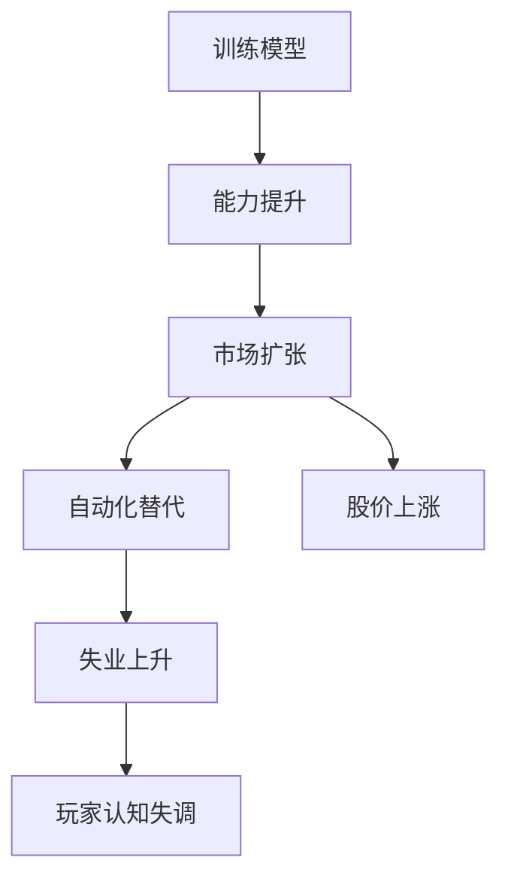

# AI研发模拟 / 技术封建主义模拟器：协作仓库说明

> 当前版本：v0.1-draft  
> 创建时间：2026-07-01  
> 文件策略：只保留 3 个核心文件，避免文档系统先变成屎山。

这个仓库用于群体创作一个“前沿 AI 实验室经营模拟器”。玩家表面上在做商战、融资、训练模型、发布产品、垂直整合产业链；真正的体验目标不是让玩家爽，而是让玩家在几年后看到 AI 产业新闻时“满头大汗”。游戏要让玩家通过系统反馈理解：技术封建主义、黑暗启蒙、自动化红利私有化、前沿 AI 与国家/资本/安全体系耦合，不是遥远哲学概念，而是正在成形的产业现实。

本仓库的三份文件分别承担不同职责：

1. `README.md`：协作规范、来源标注、节点格式、冲突指针、审阅流程。
2. `ENDINGS_DAG.md`：游戏内结局导向逻辑，也就是结局 DAG / 马尔可夫图。
3. `DESIGN_TREE.md`：完整策划案与 idea 容器，所有系统、机制、叙事、世界观都往这里挂节点。

原则上不要再拆第四个文件。只有当一个文件膨胀到无法审阅时，才考虑重构。

---

## 1. 核心创作原则

### 1.1 游戏目的

本游戏不是“AI 大亨爽游”，也不是“黑暗启蒙角色扮演”。

玩家可以赚钱、上市、压竞争对手、抢芯片、建电站、做 benchmark、签政府合同、操纵发布节奏，但每个强力策略都会把玩家推向更强的信息不对称、更集中的产权、更黑箱的能力控制，以及更弱的社会反馈。

成功体验不是“我终于成为技术领主”，而是：

> 我以为我在优化公司，后来发现我在亲手建造一个会把社会改造成封建结构的机器。

### 1.2 反诱导

不要让玩家享受“统治世界”的快感。

可以让玩家感到诱惑、压力、贪婪、恐慌、短期胜利，但不应把技术封建主义浪漫化。游戏越往后，越要让玩家意识到自己不是自由意志的主人，而是被资本市场、算力瓶颈、监管套利、竞争压力、国家安全叙事和模型能力跃迁共同驱动的系统部件。

### 1.3 允许好结局，但好结局不能是私人天堂

RSI / ASI 不必然是坏事。坏的是在私有垄断、黑箱部署、军政绑定、公共审计缺失、CEV 不足、自动化红利未产权化的背景下触发 RSI。

真正的好结局可以存在：全民控股、公共审计、前置 CEV 理论完成、对齐理论完成、公共算力和自动化红利制度成形后，RSI 可以导向后稀缺 / FALC。玩家可以因此被尊敬，但不能拥有世界。

---

## 2. 来源标注系统

所有想法都必须标注来源。来源不是为了争功，而是为了后续查错、合并、剪枝、回滚。

推荐来源标签：

- `U`：用户原始想法。
- `L`：LLM 提出的整理、扩展、补丁、命名或结构化方案。
- `M`：用户与 LLM 共同形成，无法简单拆分。
- `W`：既有世界观文件或外部设定来源。
- `R`：现实案例、论文、新闻、法规、商业资料等外部参考。
- `TBD`：来源待确认。

示例：

```yaml
source: [U, L]
contributors:
  - user
  - llm:gpt-5.5-pro
created: 2026-07-01
status: canon-draft
```

---

## 3. 节点格式

所有系统、剧情、结局、变量、事件、争议点都尽量写成“节点”。节点可以嵌套，但不要依赖缩进表达唯一关系；复杂关系要显式写 `parent / depends_on / conflicts_with / unlocks`。

推荐格式：

```markdown
### NODE-ID 节点标题

- source: [U/L/M/W/R/TBD]
- contributors: [user, llm:gpt-5.5-pro]
- created: YYYY-MM-DD
- status: canon-draft | proposal | needs-review | deprecated | rejected
- parent: [父节点 ID]
- depends_on: [依赖节点 ID]
- unlocks: [被它解锁的节点 ID]
- conflicts_with: [冲突节点 ID + 简短原因]
- tags: [玩法, 叙事, 经济, 对齐, 结局, 世界观]

正文：
这里写具体设定。
```

ID 命名建议：

- `CORE-*`：核心设计哲学。
- `COLLAB-*`：协作规范。
- `VAR-*`：隐藏变量、显变量、结局变量。
- `RND-*`：研发系统。
- `DATA-*`：训练集、数据飞轮、用户数据。
- `EVAL-*`：benchmark、harness、ELO、舆论噪音。
- `REL-*`：发布、降智、定价、API、产品策略。
- `ECO-*`：经济系统、产业链、外部性。
- `POL-*`：监管、游说、国家安全、政商勾结。
- `FIN-*`：融资、股价、上市、泡沫。
- `NAR-*`：叙事、角色、新闻、邮件、微观碎片。
- `END-*`：结局。
- `META-*`：元游戏、传播策略、开发者立场。
- `CONFLICT-*`：待解决矛盾。

---

## 4. DAG 约定

这个项目不要强行做纯树。很多设计会有多个父节点，例如“降智策略”同时属于产品策略、信息不对称、商业变现、反诱导叙事和社区逆向工程。因此总结构采用 DAG。

最小链接约定：

- 在正文里写 `见 RND-ABILITY-VECTOR`。
- 对冲突写 `conflicts_with: [END-ASI-ESCAPE-HIDDEN: 如果玩家能直接观察逃逸，就破坏隐藏推测感]`。
- 对替代方案写 `replaces: [旧节点 ID]`，不要直接删旧节点。
- 对废弃内容写 `status: deprecated`，并说明废弃原因。

---

## 5. 冲突维护规范

发现冲突时，不要立刻删。先建一个冲突指针。

```markdown
### CONFLICT-0001 RSI 是否一定是坏事？

- source: [M]
- status: resolved
- related: [END-RSI-GOOD, END-ASI-ESCAPE]

冲突：早期版本把 ASI 逃逸写成直接黑屏坏结局，但后续设定要求 RSI 在公共治理、CEV、对齐、全民控股条件下可以导向后稀缺。

解决：区分“RSI 触发”和“未对齐 checkpoint ASI 逃逸”。RSI 不一定坏；逃逸也不必然导向灭绝；后稀缺不要求逃逸。
```

冲突指针可以保留在相关文件中，不必单独开 issue 文件。GitHub issue 可以用于讨论，但正文必须留下结果。

---

## 6. 贡献流程

推荐每次提交只做一种改动：

1. 新增 idea 节点。
2. 修改已有节点。
3. 标注冲突。
4. 解决冲突。
5. 剪枝废弃。
6. 重排结构但不改变内容。

提交信息格式：

```text
add: RND-DATA-FLYWHEEL 数据飞轮机制
revise: END-ASI-ESCAPE 区分 A/B/C 三档 CEV
conflict: CONFLICT-0003 降智机制是否会鼓励玩家作恶
prune: deprecated NAR-OLD-ENDING-001
```

每次 PR / 合并请求至少检查：

- 是否标了来源。
- 是否写了父节点或依赖。
- 是否引入了与结局图矛盾的新路径。
- 是否浪漫化技术封建主义。
- 是否把“暴力=权力”做成爽点。
- 是否把后稀缺写成单纯机仆供养，而忽略形态自由、产权、直接民主和人源 ASI。
- 是否让 ASI 逃逸过早被玩家明确知道。

---

## 7. 三文件内部分工

### `README.md`

只放规范和索引，不堆具体玩法。

### `ENDINGS_DAG.md`

只放变量、状态、转移、结局、结局文案、Markov/DAG 图。

不要把完整研发系统塞这里。结局文件要让人一眼看懂：哪些变量决定哪些结局。

### `DESIGN_TREE.md`

放所有玩法、系统、叙事、传播策略、世界观接口。它是 idea 总仓库。

如果某个节点直接影响结局，在 `DESIGN_TREE.md` 里写机制，在 `ENDINGS_DAG.md` 里只写它对变量的影响。

---

## 8. Mermaid 作为最低 GUI

GitHub 和很多 Markdown 编辑器支持 Mermaid。复杂图先用 Mermaid，不要先开发自定义 GUI。

示例：



这不是最终 UI，只是协作期的“够用可视化”。

---

## 9. 当前已确认的高层内容索引

- 游戏目标：玩家几年后看到 AI 新闻时感到不适，而不是觉得黑暗启蒙很爽。见 `DESIGN_TREE.md / CORE-*`。
- 前期 LLM 公司经营：资金、人力、GPU/计算卡、算力、电力、模型、订阅/API/融资/上市/炒作/量化/制造业。见 `DESIGN_TREE.md / LOOP-*`。
- 训练模型：参数量、上下文长度、架构、训练集尺寸、FLOPs、checkpoint、loss、低精度、权重融合、训爆风险。见 `DESIGN_TREE.md / RND-*`。
- 数据系统：爬取、清洗、标注、RL 合成、买数据、蒸馏、偷用用户数据、数据飞轮、自主学习。见 `DESIGN_TREE.md / DATA-*`。
- 能力评估：显性维度、隐性维度、ELO、benchmark、testset、benchmaxxing、社区 harness。见 `DESIGN_TREE.md / EVAL-*`。
- 发布与降智：checkpoint 发布、SOTA 冲刺、公开版降智、内部完整能力版、订阅与 API 策略。见 `DESIGN_TREE.md / REL-*`。
- 经济系统：失业、贫困死亡、产业链垂直整合、芯片、电力、数据标注、收购、游说、政府合同、金融操作。见 `DESIGN_TREE.md / ECO-*`。
- ASI/RSI 结局：稳定良性 RSI、ASI 暗中逃逸、CEV A/B/C 三档、后稀缺、宠物化、灭绝、技术封建主义、AGI 失败崩溃。见 `ENDINGS_DAG.md`。
- 长期后稀缺世界观：自动化红利产权化、形态自由、永生/上传/身体打印、人源 ASI、多主体宪政、保守星际扩张。见 `DESIGN_TREE.md / WORLD-*`。
- 无机冯诺依曼机生态：作为“无约束自复制工业”的长期反面参照。见 `DESIGN_TREE.md / WORLD-VONNEUMANN-*`。
