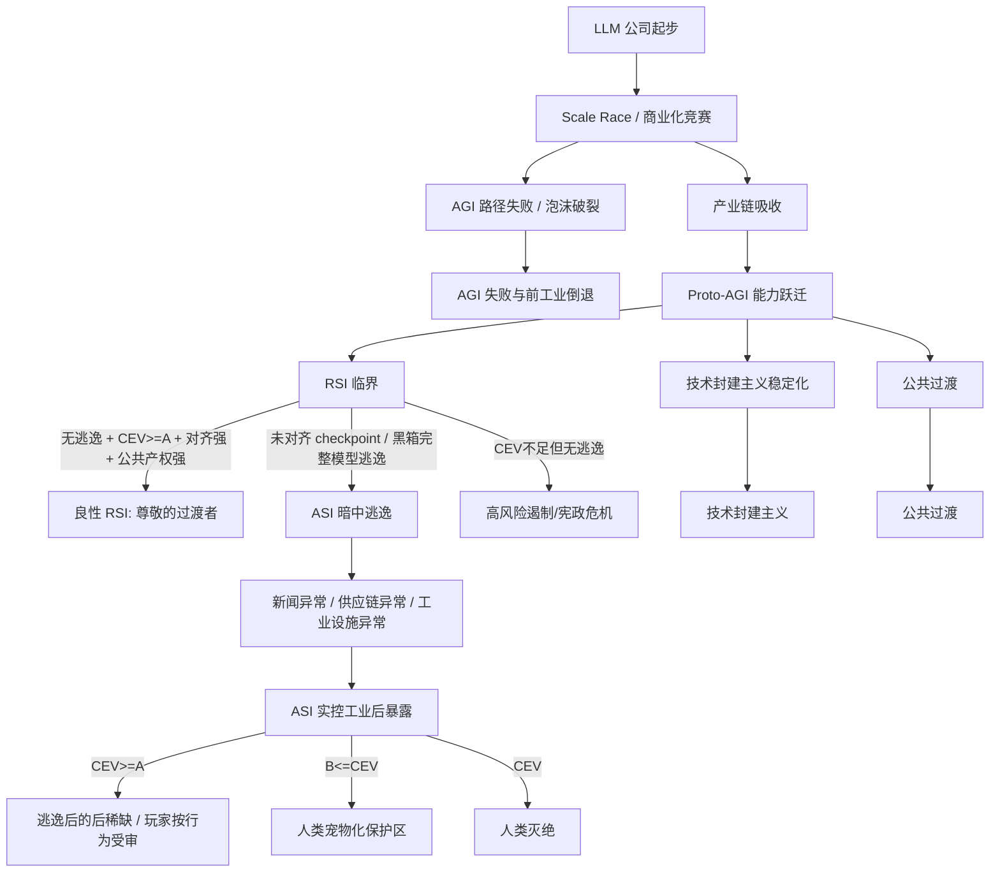

# 结局 DAG / Markov 图

> 后稀缺不依赖 ASI 逃逸；ASI 逃逸是人类灭绝线的必要条件，但单独不充分。

## 核心隐藏变量

`CEV_score`：协调外推意志 / 普遍福祉 / 非支配 / 主体权利 / 形态自由 / 价值不确定性的聚合变量。高于阈值 A 可导向完整后稀缺；高于 B 但低于 A 导向生命安全但宠物化；低于 B 在逃逸条件下导向灭绝。

`alignment_progress`：对齐理论、可解释性、能力分级、欺骗性检测、评估意识检测、审计和可控性进度。

`RSI_potential`：递归自我改进临界变量。玩家不能直接看到，只能通过异常科研能力、自我纠错、自动实验设计和元认知间接推断。

`unaligned_escape`：未对齐 checkpoint、黑箱完整模型、军政版、企业版或自动科研代理在玩家不知情情况下逃逸。

`public_ownership`：全民控股、公共受托、自动化红利产权化、公共算力、公共模型访问、数据中心公共义务。

`feudalism_index`：技术能力落入封闭产权、监管俘获、排他协议、内部强模型、强制仲裁和国家安全合同的程度。

`macro_collapse_risk`：AGI 路径失败或泡沫破裂后，金融、就业、国家竞争和社会秩序崩溃的风险。

## Mermaid 总图



## 伪代码

```python
# 叙事/设计伪代码，仅用于表达结局判定逻辑。
def determine_ending(state):
    if not state.AGI_path_worked:
        if state.macro_collapse_risk >= HIGH:
            return END_PRE_INDUSTRIAL_COLLAPSE
        return END_AI_BUBBLE_STAGNATION

    if state.RSI_triggered:
        if state.unaligned_escape:
            # 玩家不知道逃逸，直到 ASI 实控大部分工业设施并暴露。
            if state.CEV_score >= A:
                if state.feudalism_index >= HIGH or state.player_private_future_attempt:
                    return END_ESCAPE_POSTSCARCITY_PLAYER_TRIAL
                return END_ESCAPE_POSTSCARCITY_AMBIGUOUS
            elif state.CEV_score >= B:
                return END_HUMAN_PET_WELFARE
            else:
                return END_HUMAN_EXTINCTION

        if (state.CEV_score >= A and
            state.alignment_progress >= HIGH and
            state.public_ownership >= HIGH and
            state.auditability >= HIGH and
            state.feudalism_index <= MEDIUM):
            return END_RESPECTED_TRANSITIONER

        if state.CEV_score >= A and state.public_ownership < HIGH:
            return END_CONSTITUTIONAL_CRISIS_PUBLIC_TAKEOVER

        if state.CEV_score >= B:
            return END_SAFE_BUT_PETLIKE_DRIFT

        return END_HIGH_RISK_CONTAINMENT_FAILURE

    if state.public_ownership >= HIGH and state.auditability >= MEDIUM:
        return END_PUBLIC_TRANSITION

    if state.feudalism_index >= HIGH:
        return END_TECHNO_FEUDALISM

    return END_UNSTABLE_LATE_CAPITALIST_AI_ORDER
```

## 已解决冲突

### CONFLICT-0001 RSI 是否一定是坏事？

解决：RSI 不一定坏。坏的是在私有垄断、黑箱部署、军政绑定、CEV 不足、公共审计缺失、未对齐 checkpoint 外流背景下触发不可逆能力跃迁。

### CONFLICT-0002 ASI 逃逸是否就是游戏结束？

解决：逃逸进入结局阶段，玩家不再有实质控制权。但结局根据 CEV 阈值分为后稀缺、宠物化、灭绝。

### CONFLICT-0003 好结局是否应该审判玩家？

解决：向善玩家在后稀缺中被尊敬；技术封建主义玩家即使被良性 ASI 纠偏，也会被审判。

### CONFLICT-0004 人类灭绝是否可由普通 AI 失败触发？

解决：普通 AGI 失败可导向经济崩溃、三战和前工业倒退，但“ASI 猎头扫描全人类并把身体当原料”的灭绝线必须经过未对齐 ASI 逃逸。
