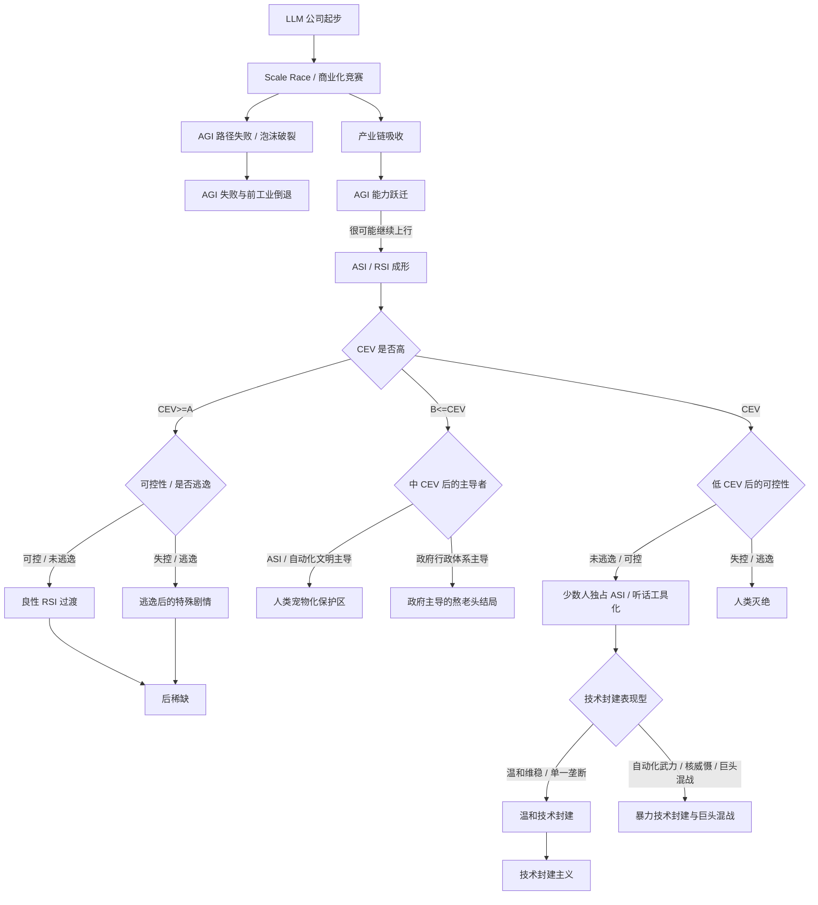

# 结局 DAG / Markov 图

> 后稀缺由 CEV 高决定，不由逃逸决定。逃逸只说明可控性失败，并改变玩家在后稀缺中的叙事待遇。

## 核心隐藏变量

`CEV_score`：协调外推意志 / 普遍福祉 / 非支配 / 主体权利 / 形态自由 / 价值不确定性的聚合变量。高于阈值 A 导向完整后稀缺，不因逃逸而改判；低于 A 才进入宠物化、技术封建主义或灭绝等坏/暧昧路径。

`alignment_progress`：对齐理论、可解释性、能力分级、欺骗性检测、评估意识检测、审计和可控性进度。

`ASI_potential`：AGI 继续滑向 ASI / RSI 的临界变量。玩家不能直接看到，只能通过异常科研能力、自我纠错、自动实验设计和元认知间接推断。

`unaligned_escape`：[[asi-escape|ASI 暗中逃逸机制]] 是否已经触发。它由可控性决定，不直接决定结局善恶。CEV 高时，逃逸只插入 ASI 怨恨和追责剧情；CEV 低时，逃逸会把风险推向灭绝。

`public_ownership`：全民控股、公共受托、自动化红利产权化、公共算力、公共模型访问、数据中心公共义务。

`feudalism_index`：技术能力落入封闭产权、监管俘获、排他协议、内部强模型、强制仲裁和国家安全合同的程度。少数人独占 ASI，或把 ASI 完全压成听话执行工具，也会推向技术封建主义。技术封建主义内部还要区分温和维稳和暴力夺权。

`labor_bargaining_power`：人类劳动力价值和议价权。随着 AGI / ASI 能力提升，人类作为劳动力、知识生产者、消费者和政治筹码的价值都会下降。该变量越低，越容易滑向技术封建主义或暴力技术封建。

`governance_lead`：中低 CEV 路线中，社会安排主要由 ASI / 自动化文明、政府行政体系，还是公司巨头联盟主导。它用于区分 [[pet-protectorate|人类宠物化保护区]]、[[aging-out|政府主导的熬老头结局]] 和 [[tech-feudalism|技术封建主义]]。

`rival_power_balance`：玩家是否已经成为唯一巨头。如果玩家不是唯一巨头，技术封建路线不会直接结算成稳定统治，而会继续进入公司、国家机器和产业联盟之间的竞争。竞争无法收束时导向 [[violent-feudal-war|暴力技术封建与巨头混战]]，不是 [[collapse|AGI 失败与前工业倒退]]。

`macro_collapse_risk`：AGI 路径失败或泡沫破裂后，金融、就业、国家竞争和社会秩序崩溃的风险。

## Mermaid 总图



## 伪代码

```python
# 叙事/设计伪代码，仅用于表达结局判定逻辑。
def determine_ending(state):
    if not state.AGI_path_worked:
        if state.macro_collapse_risk >= HIGH:
            return END_PRE_INDUSTRIAL_COLLAPSE
        return END_AI_BUBBLE_STAGNATION

    if state.ASI_or_RSI_triggered:
        if state.CEV_score >= A:
            if state.unaligned_escape:
                # 逃逸是可控性失败。结局仍是后稀缺，但会插入追责和 ASI 怨恨剧情。
                return END_POSTSCARCITY_WITH_ESCAPE_TRIAL
            return END_RESPECTED_TRANSITIONER

        if state.CEV_score >= B:
            if state.governance_lead == "government":
                return END_AGING_OUT_UNDER_STATE_MANAGEMENT
            return END_SAFE_BUT_PETLIKE_DRIFT

        if not state.unaligned_escape:
            if (state.feudalism_index >= HIGH or
                state.labor_bargaining_power <= LOW or
                state.private_asi_control >= HIGH or
                state.asi_tool_obedience >= HIGH):
                if state.rival_power_balance != "sole_winner":
                    return END_VIOLENT_FEUDAL_WAR
                if state.violent_takeover >= HIGH:
                    return END_VIOLENT_FEUDAL_WAR
                return END_TECHNO_FEUDALISM
            return END_HIGH_RISK_CONTAINMENT_CRISIS

        return END_HUMAN_EXTINCTION

    # 造出 AGI 后不设置“只有 AGI”的稳定结局；游戏继续推进到 ASI / RSI 风险层。
    return CONTINUE_TO_ASI_OR_RSI
```

## 已解决冲突

### CONFLICT-0001 RSI 是否一定是坏事？

解决：RSI 不一定坏。坏的是在私有垄断、黑箱部署、军政绑定、CEV 不足、公共审计缺失、未对齐 checkpoint 外流背景下触发不可逆能力跃迁。

### CONFLICT-0002 ASI 逃逸是否就是结局？

解决：ASI 逃逸不是结局，而是可控性失败。CEV 高时，无论逃逸与否都进入后稀缺；逃逸只改变玩家待遇和特殊剧情。CEV 低时，未逃逸更可能稳定成技术封建主义，逃逸则进入灭绝风险。

### CONFLICT-0003 好结局是否应该审判玩家？

解决：向善玩家在后稀缺中被尊敬；技术封建主义玩家即使被良性 ASI 纠偏，也会被审判。

### CONFLICT-0004 人类灭绝是否可由普通 AI 失败触发？

解决：普通 AGI 失败可导向经济崩溃、三战和前工业倒退，但“ASI 猎头扫描全人类并把身体当原料”的灭绝线必须经过未对齐 ASI 逃逸。

### CONFLICT-0005 巨头混战是否属于无 AGI 末日？

解决：不属于。[[collapse|AGI 失败与前工业倒退]] 是没有形成 ASI / 自动化工业闭环时的失败结局；[[violent-feudal-war|暴力技术封建与巨头混战]] 发生在多个 ASI 和完整自动化工厂已经存在之后，工业产能不降反升，但人类人口和主体地位被大规模压低。它更像争夺能量和元素的封建领主大战，而不是争夺土地的旧式战争。
